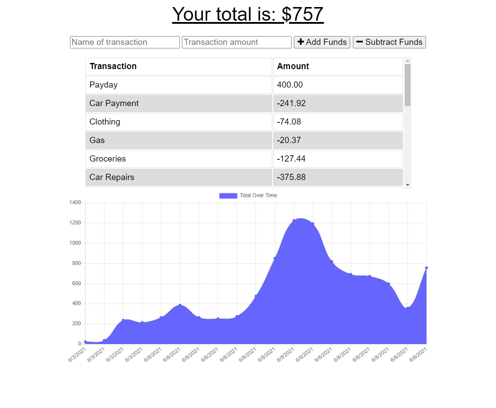

# msu-pwa-budget-tracker

## Description:
A progressive web application that lets users track their budget even when offline.

## Technologies Used:
* PWA (manifest & service workers)
* Node.js
* Express.js
* NoSQL/MongoDB
* Mongoose
* JavaScript
* HTML5/CSS3

## Deployment:
This app is deployed on Heroku: [App Link]()

## Installation:
To run this app on your local machine: 
1. Download the files and then run `npm init -y` in a working directory. 
2. Run `npm i` to install all the dependencies (note - this can take up to a few minutes). 
3. You need to have `mongod` running in the background of your computer. 
4. Run `npm start` to start the application.
5. Go to localhost:3000 to use the app.

## Screenshot:

## License

